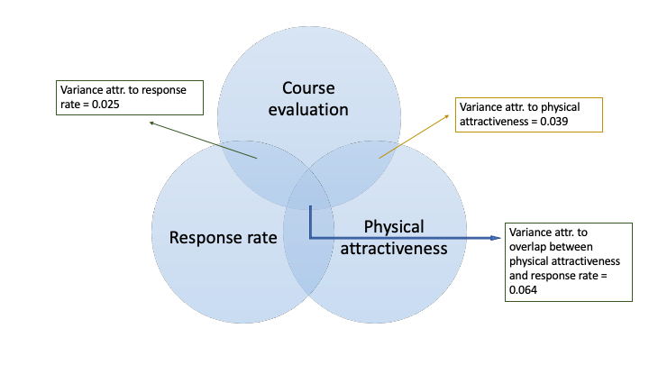
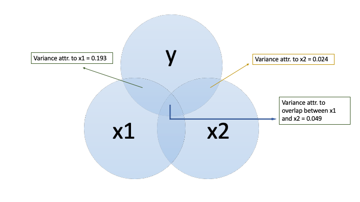
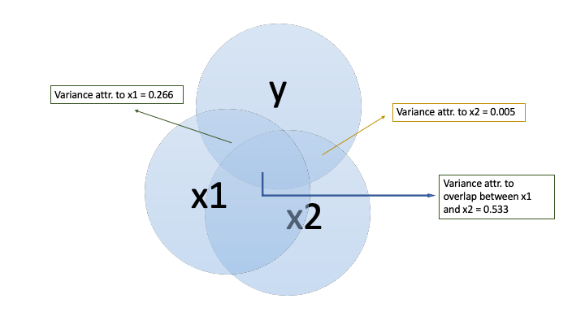

```{r setup, include=FALSE}
knitr::opts_chunk$set(echo = TRUE)
```

## Multiple Linear Regression with UT Austin Prof. Evaluation Data

```{r load_datapacks}
library(pacman)
p_load(dplyr, stats, psych, apaTables, ggplot2, yhat, AER, pwr, scales, papaja, knitr,
       MASS)
data("TeachingRatings")
#Add an indicator for proportion of students who completed a course eval
TeachingRatings <- TeachingRatings %>% 
  mutate(prop_rated = students/allstudents)

vars <- c("eval", "beauty", "prop_rated")

var.names <- c("Student Evaluation", "Physical Attractiveness", "Evaluation Response Rate")
```

The dataset contains students' course evaluations for `r nrow(TeachingRatings)` courses during the 2000-2002 academic years at UT Austin. It has (among other variables) data on the course instructor's student evaluation, physical attractiveness (z-scored and rated by a panel of six students), and the response rate for the course evaluation.

### 1. Regression models on teaching data

First, I'll regress evaluation on physical attractiveness:


```{r x1y}
mod1 <- lm(eval~beauty, data = TeachingRatings)
phys_beauty <- summary(mod1)
phys_beauty
```

Next, I'll regress evaluation onto the response rate for the course evaluation:


```{r x2y}
mod2 <- lm(eval~prop_rated, data = TeachingRatings)
resp_rate <- summary(mod2)
resp_rate
```

Finally, I'll regress course evaluations on physical attractiveness and evaluation response rate: 


```{r xy}
mod3 <- lm(eval~prop_rated+beauty, data = TeachingRatings)
mod3.sum <- summary(mod3)
var.beauty <- mod3.sum$r.squared - phys_beauty$r.squared
var.resprate <- mod3.sum$r.squared - resp_rate$r.squared
var.both <- mod3.sum$r.squared - (var.beauty+var.resprate)
#spit this out into a file--then copy and paste here
apa.reg.table(mod3, filename = 'hw4 table 1.doc', table.number = 1)
mod3.sum
```


The unique contribution to the variance in evaluations attributable to physical attractiveness is `r var.beauty`, to response rate is `r var.resprate`, and their overlap is `r var.both`



### 2a. Regression models on simulated data--not highly correlated

First, simulate the data and run the first regression model:


```{r simdata}
cmat <- matrix(c(1, .2, .4,
                 .2, 1, .5,
                 .4, .5, 1),nrow=3)
mu <- c(0,0,0) # means are zero
xydata <- mvrnorm(n = 100, mu, cmat, empirical = FALSE)
colnames(xydata) <- c("x1","x2","y")
cor(xydata)
xydata <- as.data.frame(xydata)
class(xydata)
modelreg <- lm(y~x1,data=xydata)
modelreg.sum <- summary(modelreg)
modelreg.sum
```

Next, add x2 to the model:


```{r simdata1}

modelreg2 <- lm(y~x2,data=xydata)
modelreg2.sum <- summary(modelreg2)
modelreg2.sum
```

Finally, I'll add x1 and x2 to the model: 


```{r simdata2}
modelreg3 <- lm(y~x1+x2, data = xydata)
#spit this out into a file--then copy and paste here
apa.reg.table(modelreg3, filename = 'hw4 table 2.doc', table.number = 2)
modelreg3.sum <- summary(modelreg3)
var.x1 <- modelreg3.sum$r.squared - modelreg.sum$r.squared
var.x2 <- modelreg3.sum$r.squared - modelreg2.sum$r.squared
var.x2x1 <- modelreg3.sum$r.squared - (var.x1+var.x2)
modelreg3.sum
```


The unique contribution to the variance in evaluations attributable to x1 is `r var.x1`, to response rate is `r var.x2`, and their overlap is `r var.x2x1`




### 2b. Regression models on simulated data--highly correlated

First, simulate the data and run the first regression model:


```{r simdata3}
cmat <- matrix(c(1, .8, .75,
                 .8, 1, .9,
                 .75, .9, 1),nrow=3)
mu <- c(0,0,0) # means are zero
xydata <- mvrnorm(n = 100, mu, cmat, empirical = FALSE)
colnames(xydata) <- c("x1","x2","y")
cor(xydata)
xydata <- as.data.frame(xydata)
class(xydata)
modelreg <- lm(y~x1,data=xydata)
modelreg.sum <- summary(modelreg)
modelreg.sum
```

Next, add x2 to the model:


```{r simdata4}

modelreg2 <- lm(y~x2,data=xydata)
modelreg2.sum <- summary(modelreg2)
modelreg2.sum
```

Finally, I'll add x1 and x2 to the model: 


```{r simdata5}
modelreg3 <- lm(y~x1+x2, data = xydata)
#spit this out into a file--then copy and paste here
apa.reg.table(modelreg3, filename = 'hw4 table 3.doc', table.number = 3)
modelreg3.sum <- summary(modelreg3)
var.x1 <- modelreg3.sum$r.squared - modelreg.sum$r.squared
var.x2 <- modelreg3.sum$r.squared - modelreg2.sum$r.squared
var.x2x1 <- modelreg3.sum$r.squared - (var.x1+var.x2)
modelreg3.sum
```


The unique contribution to the variance in evaluations attributable to x1 is `r var.x1`, to response rate is `r var.x2`, and their overlap is `r var.x2x1`



### 3. Multiple regression and dominance analysis

Simulate the dataset with 3 predictors:

```{r simdata6}
cmat <- matrix(c(1, .2, .3, .4,
                 .2, 1, .4, .2,
                 .3, .4, 1, .5,
                 .4, .2, .5, 1),nrow=4)
mu <- rep(0, 4)
xydata <- mvrnorm(n = 100, mu, cmat, empirical = TRUE)
colnames(xydata) <- c("x1","x2","x3","y")
cor(xydata)

xydata <- as.data.frame(xydata)
class(xydata)
modelreg <- lm(y~x1+x2+x3,data=xydata)
apa.reg.table(modelreg, filename = 'hw4 table 4.doc', table.number = 4)
summary(modelreg)

```

Next, the dominance analysis:

```{r simdata6}

# all possible subsets regression
apsOut <- aps(xydata,"y",c("x1","x2","x3"))
apsOut
# dominance analysis
dominance(apsOut)
```

(a) explain the increment in R2 when each predictor is entered last to create the full three-variable model (i.e., the increase in R2 when X1 is entered last, over X2 and X3; then same for X2 over X1 and X3, and X3 over X


